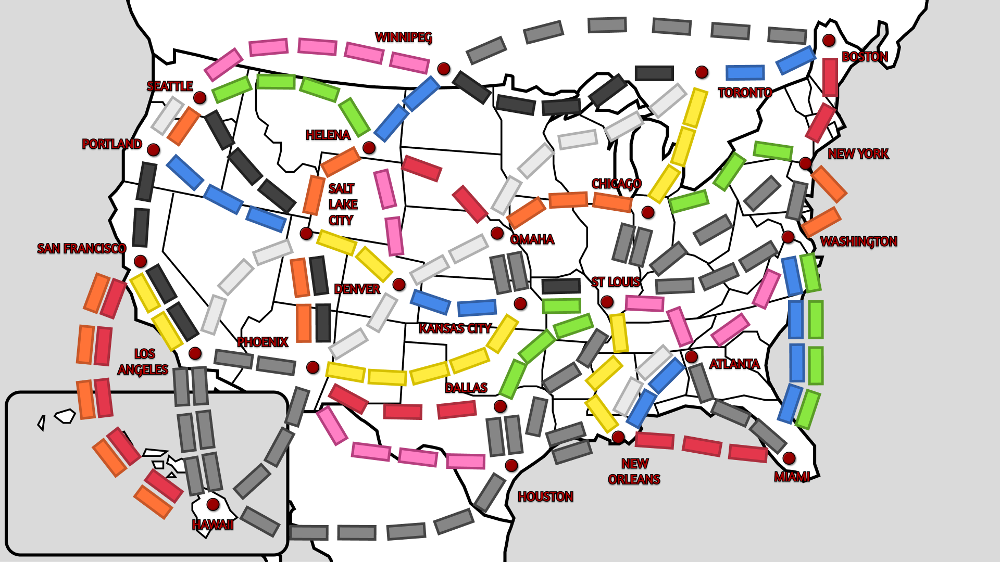

# Koleją przez Stany

- Internetowa wersja gry familijnej "Wsiąść do pociągu" dla czterech osób!
- Wybierz się w niesamowitą podróż po wielkich miastach Ameryki!
- Wyzwól w sobie nieustraszonego stratega, który za pomocą taktycznego myślenia będzie zajmował poszczególne cele na mapie!
- Zdobywaj punkty poprzez tworzenie tras pomiędzy miastami oraz za realizowanie biletów!
- Wygrywasz w momencie zdobycia największej liczby punktów!

 

## Zasady gry

Każdy gracz zaczyna z pakietem 35 wagoników kolejowych które służą mu do budowania tras.  
Na starcie gry każdy gracz dobiera minimum 2 karty biletów.  
Karty biletów służą do zdobywania punktów za zbudowanie trasy przedstawionej na bilecie, a karty wagoników służą do budowania tras - w momencie w którym mamy odpowiednią liczbę kart wagoników danego koloru, możemy zbudować odpowiadającą temu kolorowi trasę na mapie.  
Tęczowe karty wagoników symbolizują dowolny kolor, tak samo jak szare pole na planszy.  
Pozostałe karty biletów należy odłożyć obok na stos a z pozostałego stosu kart wagoników należy dobrać 5 kart i położyć we wspólnym obszarze gry.   

Po dobraniu kart i ustaleniu kolejności graczy, każdy gracz w turze ma do dyspozycji jedną z trzech akcji: 
- Utworzenie trasy pomiędzy miastami wykorzystując do tego swoje karty wagoników. Zużyte karty wagoników są odkładane obok na stos i wyłączone z gry.
- Dobranie 2 kart wagoników ze wspólnego obszaru gry. Obszar ten następnie jest uzupełniany aby w każdej turze gracza zawierał 5 kart.
- Dobranie 1 karty biletów ze stosu kart.  

Trasy na mapie mogą być zajęte tylko przez jednego gracza. W momencie w którym karty wagoników ze wspólnego obszaru się skończą, brany jest z powrotem obszar zużytych kart.  

W momencie gdy jeden z graczy będzie posiadał dostępne już tylko 4 wagoniki do budowania tras, następuje ostatnia tura. Po ostatniej turze podliczane są punkty z ukończonych tras z kart biletów każdego gracza. Gracz z największą liczbą punktów wygrywa!  

## Serwis

Każdy gracz aby zagrać, musi utworzyć wcześniej swoje konto. Po zalogowaniu się może utworzyć własny stół do gry bądź dołączyć do już istniejącego. Aby dołączyć do istniejącego stołu, wymagane jest podanie ID udostępnionego przez twórcę pokoju.   

## Autorzy

- [@czecho999](https://www.github.com/czecho999) Karol Czechowski
- [@daveekh](https://www.github.com/daveekh) Dawid Nadzieja
- [@PawelVoitovitch](https://www.github.com/PawelVoitovitch) Paweł Wójtowicz
- [@zaju2611](https://www.github.com/zaju2611) Jakub Zając

https://docs.google.com/document/d/1S7zgQhnVAtx4eOaVBSJujdr2iT0fE728yZbA4pfw7Q8/edit

    
todo:
- wersja angielska

